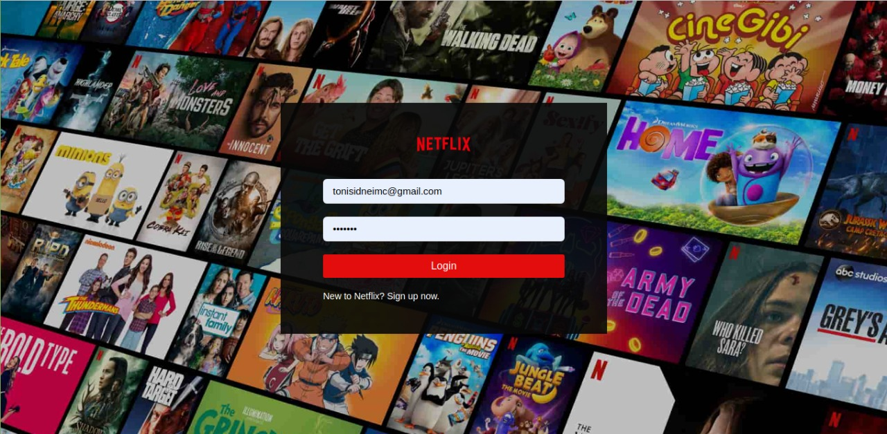
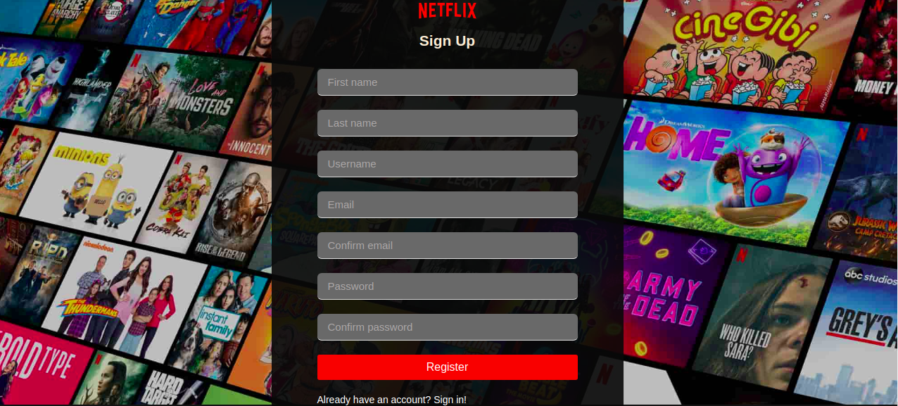
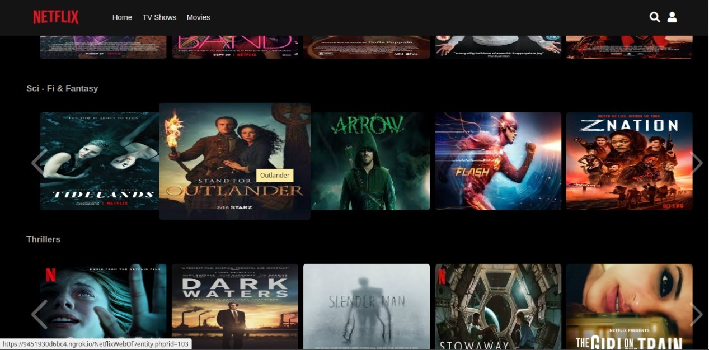

## <h1>Netflix-Clone</h1>

## :boom: **Project Demo**

  

## :bomb: **Project Photos**

  

  
 

## :fire: **Features** 

:heavy_check_mark:  Login and Register  System 

:heavy_check_mark:  Movies Preview 

:heavy_check_mark:  Movies  Category 

:heavy_check_mark:  Movies  Catalog Swiper

:heavy_check_mark:  Movies  Player

:heavy_check_mark:  Recommentation  system

:heavy_check_mark:  Movie Progress Saver 

:heavy_check_mark: Search System

## :rocket:  **Used Technologies**

🔨 HTML 

🔨 CSS 

🔨 PHP 

🔨 JAVASCRIPT 

🔨 JQUERY 

## :wrench:  **Building the Project**

:arrow_right: Use XAMPP for local web server

:arrow_right: Put the project folder inside XAMPP folder htdocs

:arrow_right: Create a database in phpmyadmin

:arrow_right: Import  Database tables for phpmyadmin

:arrow_right: Install swiperjs  for swiper feature

  

## :construction_worker:  **Contributors**

@[AlexsanderDamaceno](https://github.com/AlexsanderDamaceno)

@[tonisidneimc](https://github.com/tonisidneimc)

